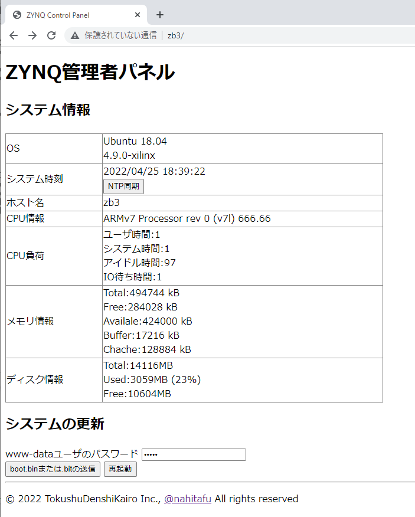

# ZYNQ Admin Panel
## これはなに？
このツールはZYNQで動くLinuxのシステム管理をWeb経由で行えるようにするものです。

ZYNQ Linuxの時計、NTP同期、CPUの使用率、メモリ使用量、ディスク使用量などを見ることができ、boot.binの書き換えや再起動もできます。

[](./doc/image1.png)

再利用がしやすいように、非常に質素なデザインとシンプルなJavaScriptで作られています。

このWeb画面にお好みのCSSを適用したりして、お客様のシステムに組み込んで使ってください。

## 動作環境
Ubuntu 14.04LTS または Ubuntu 18.04LTSが動作しているZYNQ Linux

## ダウンロードとインストール
ZYNQ Admin panelのインストールは、/var/www/html 配下の任意のフォルダにこのレポジトリをダウンロードするだけです。

```
cd /var/www/html
git clone https://github.com/tokuden/zynq-admin.git
```

## Apache2でCGIを有効にする
このシステムはCGIを使っているので、Apache2からCGIが動くようにしなければなりません。

まず、/etc/apache2/sites-available/000-default.conf を書き換えます。

CGIを実行するディレクトリには+ExecCgiの指定が必要です。また、AddHandlerで.cgiの拡張子がCGIであることを指示してください。  
ディレクトリは環境に合わせて書き換えてください。

```
<VirtualHost *:80>
・・中略・・・
        DocumentRoot /var/www/html  ←環境に合わせて変更する
        <Directory /var/www/>  ←環境に合わせて変更する
            Options -Indexes +FollowSymLinks +MultiViews +ExecCgi  ←+ExecCgiを追加
            AllowOverride All
            Order allow,deny
            allow from all
        </Directory>

        AddHandler cgi-script .cgi .pl ←この行を追加
・・中略・・・
```

そして、
```
$ sudo a2enmod cgid
$ sudo systemctl restart apache2
```
でCGIを有効にしてApache2を再起動します。

--------
# 使い方
## Adminパネルの表示
http://<*ZYNQ LinuxのIPアドレス*>/zynq-admin/
で、Web画面にシステム情報を表示することができます。

## OS基本情報
テーブルの上部には
+ OSの種類と、カーネルのバージョンを表示します(unameコマンド)
+ ZYNQ Linuxの時刻(dateコマンド)
+ ホスト名(hostnameコマンド)
+ CPU情報(/proc/cpuinfo)

が表示されます。


「NTP同期」ボタンを押すと、NTPサーバに接続して時刻を調整します。

## CPU、メモリ、ディスクの負荷
テーブルの下部には、
+ CPUの負荷(vmstatコマンド)
+ メモリの容量と状態(/proc/meminfo)
+ ディスクの容量と空き(dfコマンド)

が表示されます。


## システムの更新
Web画面の中からboot.binの更新を行うことができます。

まず、www-dataユーザ(Apache2のCGI実行ユーザ)のパスワードをテキストボックスに入力し、下の画面に表示されている「boot.binまたは.bitの送信」ボタンを押すと、


次のダイアログが開きます。ここで「ファイルを選択」ボタンを押して、.binファイルか、.bitファイルを選びます。


.bitファイルを選ぶと、Vivadoで生成したBitStreamファイルを送信し、ZYNQ Linux上でbootgenを起動してboot.binを作って、SDカードの第一パーティションにコピーします。ホストPCでbootgenを行うのが面倒な場合は.bitファイルを送ってください。


.binファイルを選ぶと、ホストPCのVivadoで作ったboot.binをSDカードの第一パーティションにコピーします。bootgenはPCでやりたい場合や、過去に作ったboot.binを変えて試してみたいときには、.binを送ってください。


## 再起動
「再起動」ボタンを押すと、確認のダイアログが出たあとリブートします。


通常のZYNQ Linuxならば約1分で再起動が完了します。


--------

# 管理コマンドを使うためのセットアップ
システム情報を表示するだけであれば、git cloneとCGIの許可だけ使えますが、システムの設定を変更するには、CGIから管理者権限が必要なコマンドが使えるようにしなければなりません。  そのためには設定ファイルをいくつか変更する必要があります。

## Webから再起動ができるようにする
Linuxの再起動は/sbin/rebootというプログラムで行われます。  
※実は、Ubuntu 18ではrebootは/bin/systemctlへのシンボリックリンクなのです。

rebootの実行にはroot権限が必要ですが、CGIで動くプログラムはwww-dataというユーザの権限で動くので、rebootをCGIから実行するためには、/etc/sudoersに記述を追加しなければなりません。  以下、CGIからrebootを行うための方法を説明します。

## /etc/sudoersを書き換えて管理者コマンドをCGIから実行できるようにする

管理者以外の一般ユーザ(ApacheのCGIも含む)から管理者権限のコマンドを実行できるようにするには、/etc/sudoersにその旨を記載します。  
使い方を誤ってsudoersを壊してしまうとシステム全体が使えなくなる危険があるので、/etc/sudoersを直接書き換えることはせず、visudoというツールを使います。  
くれぐれも注意深く作業してください。

まず、
`sudo visudo`
を実行して、/etc/sudoersを開きます。

書き換える場所は20行目付近にある、User privilege specificationの後の部分です。rootの後ろにwww-dataユーザ向けの追加をしてください。

```
# User privilege specification
root    ALL=(ALL:ALL) ALL
www-data ALL=(ALL:ALL) /sbin/reboot, /bin/systemctl, /bin/cp, /bin/hostname
```

です。

追加すべきコマンドは、

- /sbin/reboot ・・・ 再起動ができるようになる
- /bin/systemctl ・・・ サービスの開始/停止ができるようになる(Ubuntu18)
- /bin/cp ・・・ boot.binを始め、システムファイルを書き換えられるようになる
- /bin/hostname ・・・ ホスト名を変更できるようになる
- /bin/ping ・・・ PINGが打てるようになる(Ubuntu14)

なお、Ubuntu 18ではPingは管理者権限を必要としなくなったので追加する必要はなくなりました。

## www-dataのパスワードを設定する
デフォルトでは、www-dataというCGIユーザのパスワードは設定されていないので、www-dataからrootになることができません。

```
sudo passwd www-data
```

でwww-dataのパスワードを変更してください。

## boot.binを更新できるようにする
ZYNQの起動ファイルは"boot.bin"で、このファイルはSDカードの第一パーティションに書き込まれています。通常はVivadoでboot.binを作ったらSDカードに書き込むとされていますが、SDカードを抜き差ししてWindows PCに挿すのは非常に手間がかかるので、まさか、一回一回抜き差ししている人はいないと思いますが・・

やはり、ZYNQのLinuxでSDカードをマウントして、コマンドで書き換えられるようにしましょう。

まず、` sudo mkdir /mnt `で、/mntというフォルダを作り、ここにSDカードの第一パーティションをマウントするようにします。起動時に自動的にマウントするように/etc/fstabを編集します。

```
# UNCONFIGURED FSTAB FOR BASE SYSTEM
/dev/mmcblk0p1 /mnt vfat
```

これで、起動時に/mntフォルダにSDカードの第一パーティションがマウントされるようになります。

## bootgenで使われるu-boot.elfとfsbl.elfはどこにある？
本リポジトリでは、u-boot.elfとfsbl.elfのサンプルのものをcgi-bin/mkboot/の中にいれてあります。
このu-boot.elfとfsbl.elfはXC7Z030用のものなので、実際に使い始める前にはユーザのシステムに合わせてu-boot.elfとfsbl.elfを置き換えるようにしてください。(そのうちアップロードできるようにします)

## NTPの同期ができるようにする
現在時刻のところにあるボタン「Sync」を押すと、サーバ上でntpdateというプログラムが走り、時刻を同期します。

ARM 32bit版 Ubuntu Linuxの14.04ではntpdateがありますが、Ubuntu 18.04にはデフォルトでは入っていません。Web上から時刻を同期するボタンを使えるようにするには、 ` apt install ntpdate ` でntpdateをインストールしておいてください。
